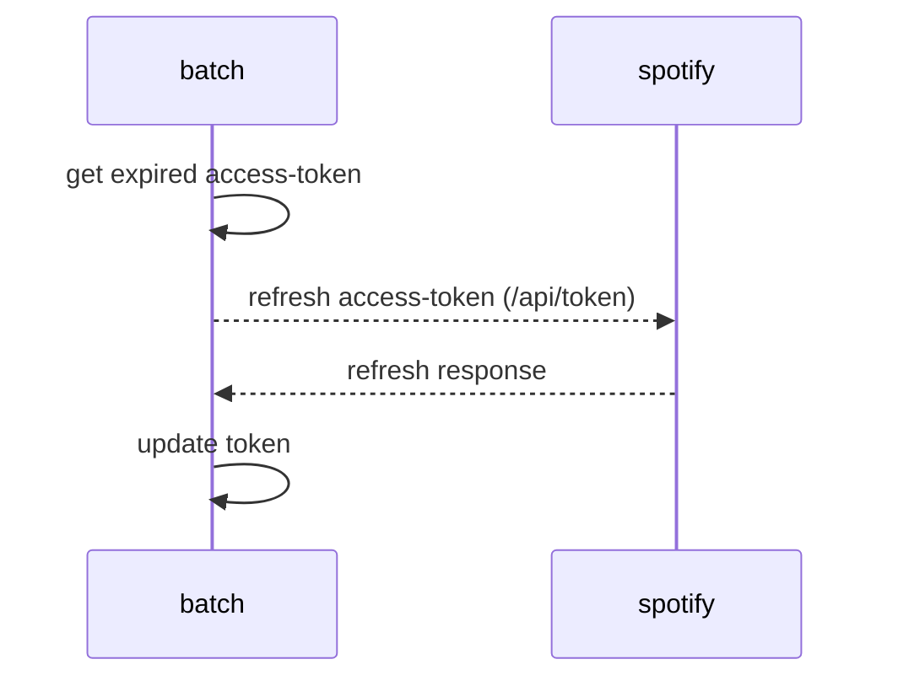
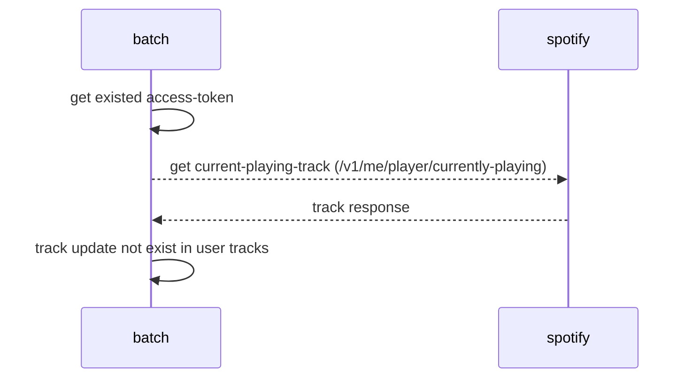

# songspy-core-api

**지금 무슨 노래 듣고 있으세요?** 를 모티브로 
현재 사람들이 듣고 있는 곡을 확인할 수 있는 서비스입니다.

```spoitfy``` oauth를 이용해서 현재 사람들이 듣고 있는 곡 정보를 조회합니다.

## 배치
```songspy-batch``` 모듈을 통해 배치성 작업을 스케줄러로 구현했습니다.

### AccessTokenRefreshScheduler

spotify를 연동한 고객들의 access-token을 지속적으로 refresh할 수 있는 Scheduler입니다.

```30분``` 간격으로 작업을 수행합니다.

***Sequence Diagram***



### CurrentPlayingTrackScheduler

spotify를 연동한 고객들의 access-token을 이용하여 현재 듣고 있는 곡 정보를 조회한 후, 저장하는 Scheduler입니다.

```3분``` 간격으로 작업을 수행합니다.

***Sequence Diagram***

